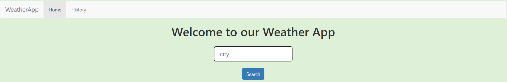
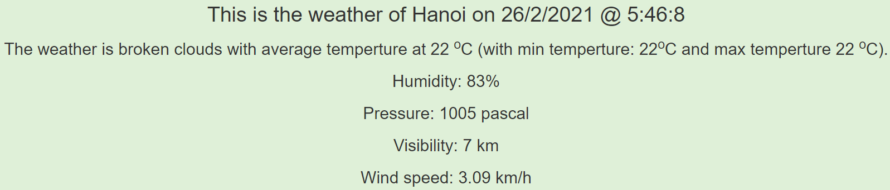
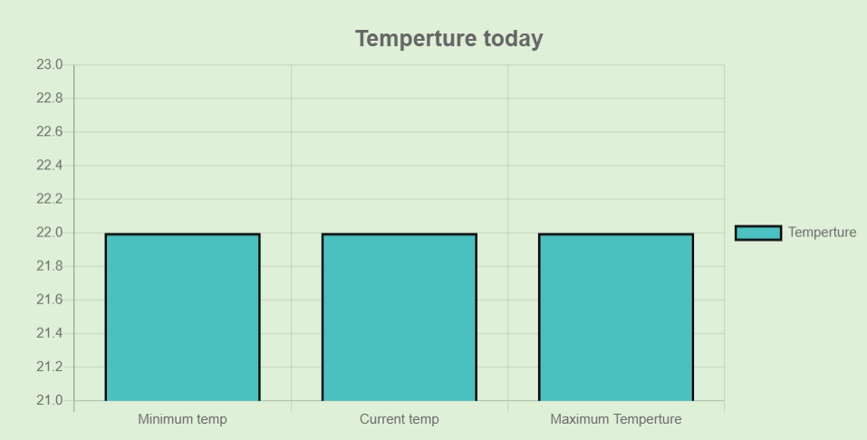
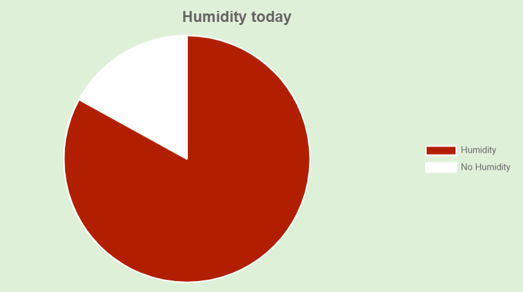
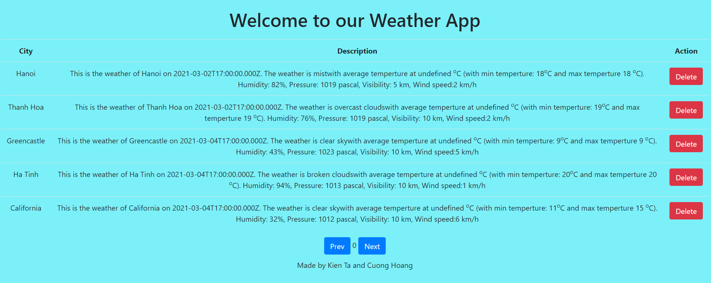

<h1>Welcome to our weather app</h1>

<h2>Steps to install</h2>
<ul>
  <li>Make sure you have nodejs and npm installed</li>
  <li>Do <strong>npm install</strong> in the directory named <strong>weather-app</strong> and <strong>restdful-api</strong> </li>
  <li>Do <strong>npm start</strong> in the directory named <strong>weather-app</strong> and <strong>node app.js</strong> in the directory named <strong>restdful-api</strong> </li>
  <li>Make sure you have MySQL database installed. Run the queries in .sql file to set up</li>
  <li>Visit the web at <strong> http://localhost:3000</strong></li>
</ul>

<h2>Overview</h2>

This is the home page where you search for weather by giving the city as the query

And the information after submitting the form

The generated bar chart about temperture

The generated pie chart about humidity

And finally, the search history

